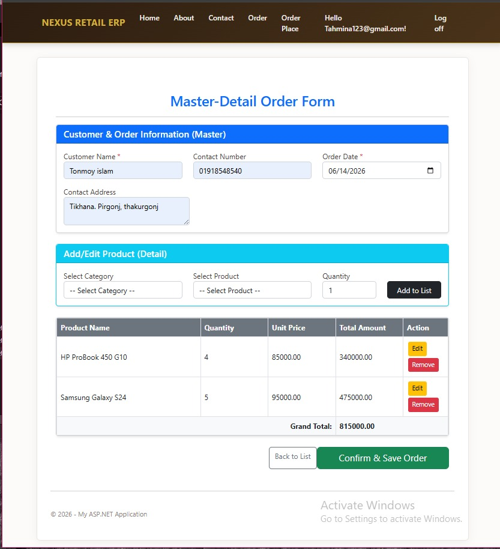
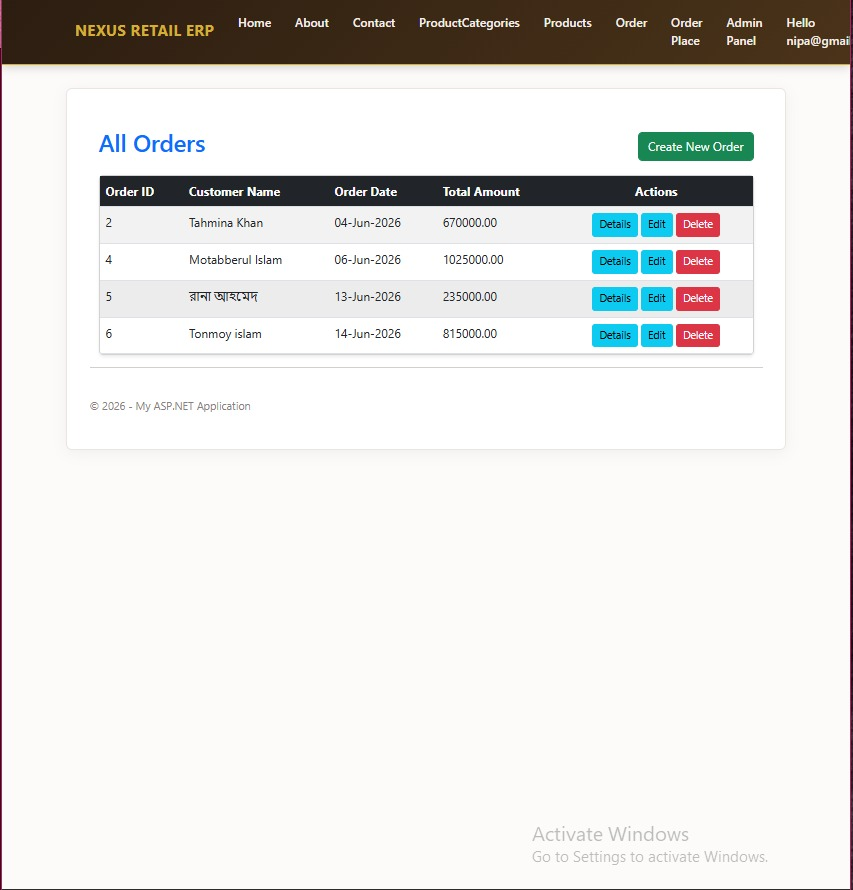
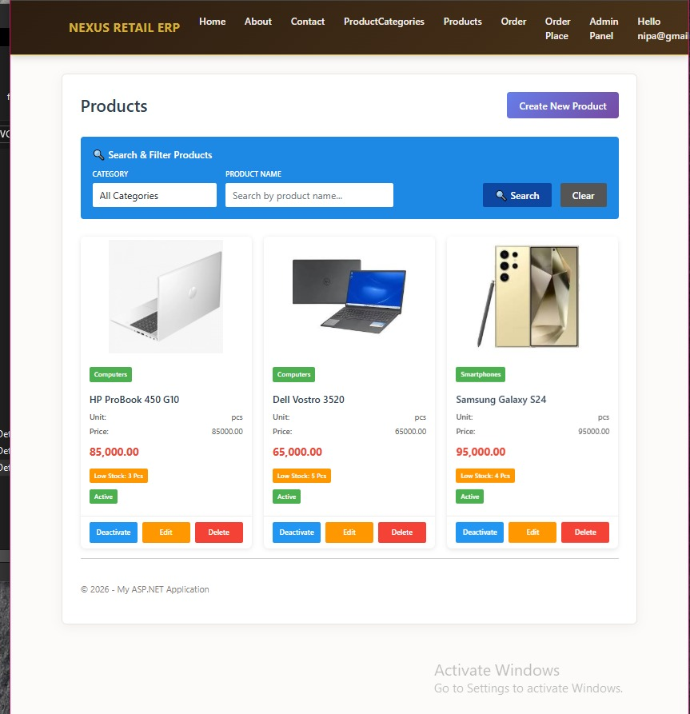
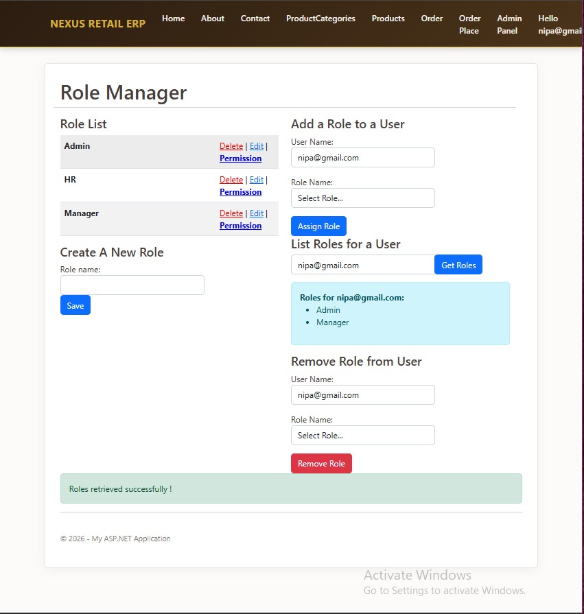
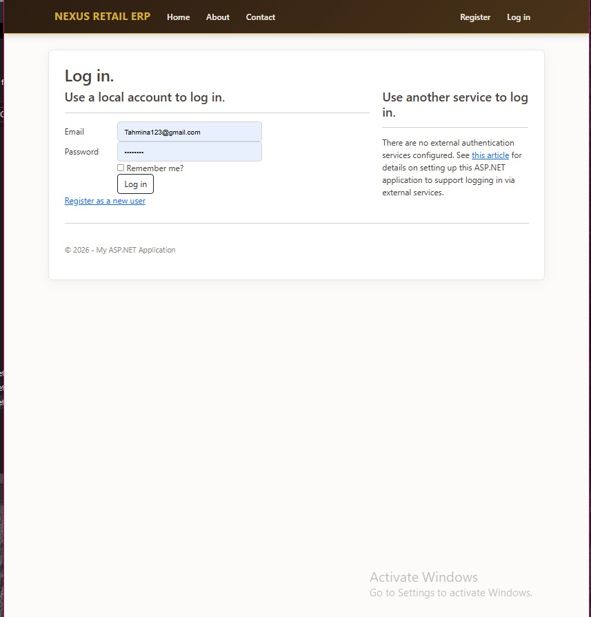

# 🏪 Nexus Retail ERP - Master-Details Order Management System


## 📌 Project Overview

**Nexus Retail ERP** is a complete web-based order management system built with **ASP.NET MVC 5** and **Entity Framework 6 (Code-First)**. The system follows the **Master-Details architectural pattern** where each Order (Master) contains multiple Order Details (Details).

### 🎯 Key Features

| Module | Features |
|--------|----------|
| **Order Management** | Create, Edit, Delete, View orders with master-details pattern |
| **Product Management** | CRUD operations, image upload, stock tracking, active/inactive toggle |
| **Category Management** | Organize products into categories |
| **Role Management** | Admin panel for user roles and permissions |
| **Security** | Authentication, Authorization, Permission Matrix |

---

## 🖼️ Screenshots

### 1. Order Create Page (Master-Details Form)

*Master-Details order form with customer info (Master) and product cart (Details). Features cascading dropdowns, AJAX product loading, and real-time total calculation.*

### 2. Order List Page

*Complete list of all orders with search/filter options. Each row has action buttons for Details, Edit, and Delete operations.*

### 3. Product Management (Card View)

*Modern card-based product display with image, price, stock status, and active/inactive badge. AJAX-powered search and filter by category.*

### 4. Admin Panel - Role & Permission Management

*Complete role management system. Create roles, assign to users, and configure controller-action level permissions.*

### 5. Login Page

*Secure authentication system with registration, login, and role-based access control.*

---

## 🛠️ Technology Stack

| Backend | Frontend |
|---------|----------|
| ASP.NET MVC 5.2.9 | Bootstrap 5.2.3 |
| Entity Framework 6.5.1 | jQuery 3.7.0 |
| C# .NET 4.8 | HTML5/CSS3 |
| SQL Server LocalDB | Responsive Design |
| Microsoft Identity 2.2.4 | AJAX |

---

## 💡 How Master-Details Pattern Works
─────────────────────────────────────────────────┐
│ ORDER (MASTER) │
│ ┌───────────────────────────────────────────┐ │
│ │ Customer: John Doe | Date: 15-Jan-2024 │ │
│ └───────────────────────────────────────────┘ │
│ │ │
│ ▼ │
│ ┌───────────────────────────────────────────┐ │
│ │ ORDER DETAILS (DETAILS) │ │
│ ├────────────┬──────────┬────────┬─────────┤ │
│ │ Product │ Quantity │ Price │ Total │ │
│ ├────────────┼──────────┼────────┼─────────┤ │
│ │ Laptop │ 2 │ $800 │ $1,600 │ │
│ │ Mouse │ 3 │ $20 │ $60 │ │
│ ├────────────┼──────────┼────────┼─────────┤ │
│ │ │ Grand Total: $1,660 │ │
│ └────────────┴──────────┴────────┴─────────┘ │
└─────────────────────────────────────────────────┘


### Step-by-Step Process

| Step | Action | Description |
|------|--------|-------------|
| 1 | Customer Info | Enter customer details (Master data) |
| 2 | Select Category | Choose product category from dropdown |
| 3 | Select Product | Products load via AJAX based on category |
| 4 | Enter Quantity | Specify quantity (validated against stock) |
| 5 | Add to List | Product added to details table (AJAX, no refresh) |
| 6 | Real-time Total | Grand total updates automatically |
| 7 | Edit/Remove | Modify or delete items from cart |
| 8 | Save Order | All data saved with stock deduction |

---

## 🚀 Quick Installation

### Prerequisites

| Software | Version |
|----------|---------|
| Visual Studio | 2019 or 2022 |
| .NET Framework | 4.8 |
| SQL Server | LocalDB or Express |
| Git | Latest |

### Installation Steps

```bash
# 1. Clone repository
git clone https://github.com/TahminaKhanNipa10-Codes/NexusRetailERP-mvc-cf.git

# 2. Open project in Visual Studio
# Double-click .sln file

# 3. Restore NuGet packages
Update-Package -Reinstall

# 4. Build and Run (Press F5)
